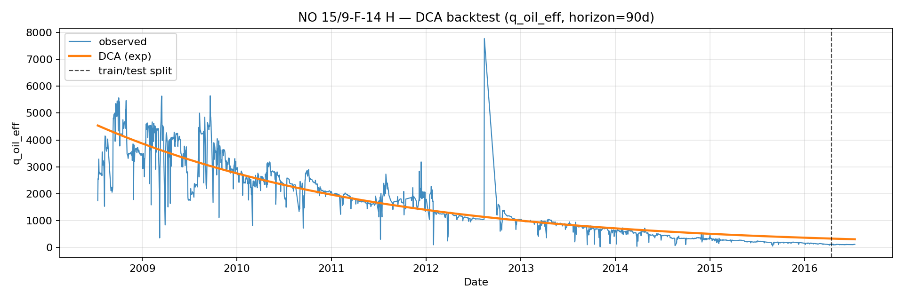
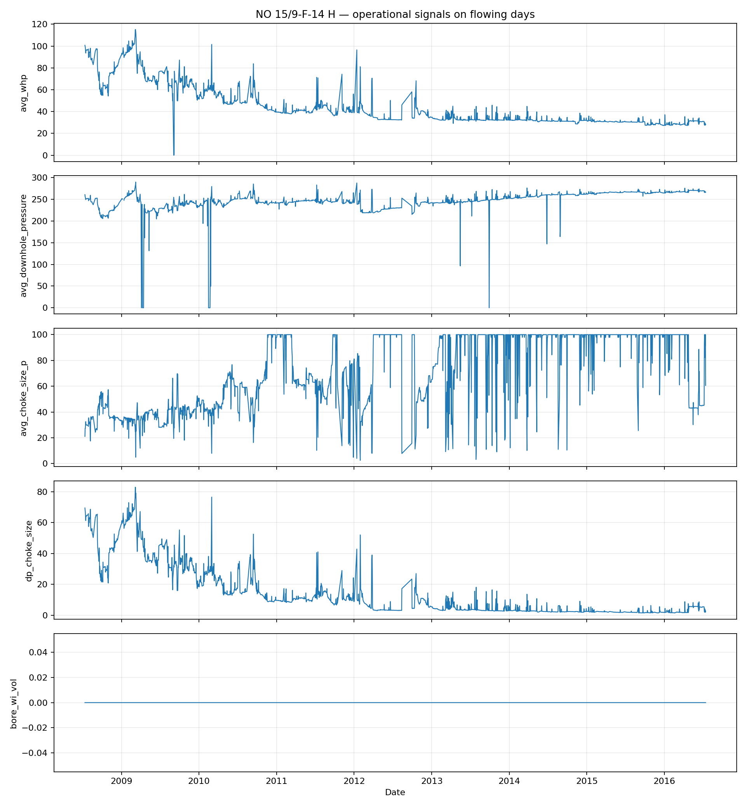
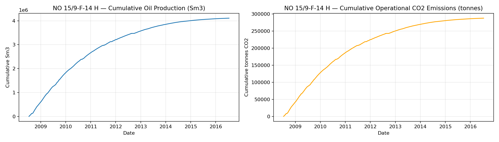
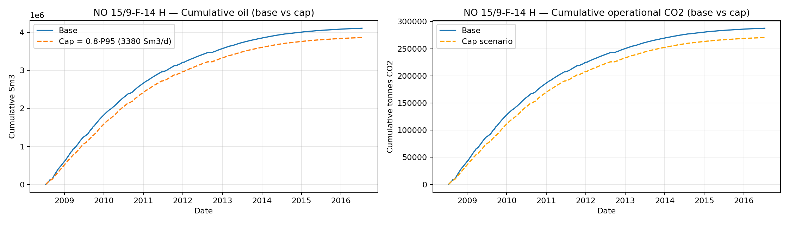

# Volve reservoir forecasting + operational signals (Volve, Equinor Open Data)

This repository is a compact, explainable reservoir-engineering showcase built on **real Equinor Volve daily wellbore data**. It covers **QC of downtime**, a transparent **DCA baseline forecast** (exponential vs hyperbolic), **time-based backtesting** (RMSE/MAE), and decision-support visuals: **operational signals (pressure/choke/injection)** plus an **operational CO₂ proxy** and a **rate-cap scenario**.

## Key files (start here)

- **Dashboard**: `app/streamlit_app.py`
- **Preprocessing**: `scripts/preprocess_volve.py` → outputs `data/processed/volve_daily.csv`
- **Notebooks (repro + figures)**:
  - `notebooks/01_data_qc_eda.ipynb`
  - `notebooks/02_dca_forecasting.ipynb`
- **Report (readable)**: `reports/TECHNICAL_REPORT.md`
- **Report (Overleaf)**: `reports/TECHNICAL_REPORT.tex`

## Example (what to look at)

Open the dashboard, select a well (default **NO 15/9-F-14 H**), then:
- **Downtime**: confirms shut-ins/operational stops (zeros are not reservoir decline).
- **Effective oil rate** (`q_oil_eff`): uptime-corrected “flowing” rate for cleaner decline behavior.
- **DCA fit + backtest**: exponential vs hyperbolic; time split; errors reported as **RMSE/MAE** in Sm³/d.
- **Operational signals**: choke/pressure/injection explain regime shifts and why DCA can miss.
- **Emissions + scenario**: intensity-based operational CO₂ proxy + data-derived cap (0.8×P95) to show trade-offs.

## Preview figures (from the notebooks)

**DCA backtest (example well):**


**Operational signals (pressure/choke/injection):**


**Emissions proxy + rate-cap scenario:**



## Quickstart (run locally)

```bash
git clone https://github.com/MaidenTaief/volve-reservoir-forecasting-operational-signals.git
cd volve-reservoir-forecasting-operational-signals

python -m venv .venv
source .venv/bin/activate
pip install -r requirements.txt
```

### Data (not included in the repo)

Download the Excel from Kaggle:
- https://www.kaggle.com/datasets/lamyalbert/volve-production-data

Place it here:
- `data/raw/Volve production data.xlsx`

Preprocess:

```bash
python scripts/preprocess_volve.py --input data/raw --output data/processed/volve_daily.csv
```

Run the dashboard:

```bash
streamlit run app/streamlit_app.py
```

Open: `http://localhost:8501`

## Notes

- **Emissions**: this is an **intensity-based proxy** (not metered facility emissions). See the report for assumptions/limitations.

